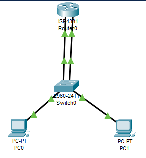

# Laporan Praktikum Konsep Jaringan

### Nama : Muhammad Rizal

### NRP : 3121600007

### Kelas : 2 D4 Teknik Informatika A

# Praktikum 5 - VLAN

## A. Pengertian VLAN

VLAN adalah virtual local area network atau suatu model jaringan yang tidak terbatas pada lokasi fisik seperti LAN, hal ini mengakibatkan suatu network dapat dikonfigurasi secara virtual tanpa harus menuruti lokasi fisik peralatan. Penggunaan VLAN akan membuat pengaturan jaringan menjadi sangat fleksibel karena dapat dibuat segmen yang bergantung pada organisasi, tanpa bergantung lokasi workstations, eperti kita ketahui bahwa switch tidak bisa membaca Layer 3 sehingga tidak bisa membaca Network sehingga hanya bisa dihubungkan hanya satu network saja.

## Kegunaan VLAN

- Menimalisir kemungkinan terjadinya konflik IP yang terlalu banyak.
- Mencegah terjadinya collision domain (tabrakan domain).
- Mengurangi tingkat vulnerabilities.

## Jenis-jenis VLAN dalam Switch

1. VLAN default adalah VLAN yang sudah ada secara default contoh di cisco VLAN1,VLAN1002
2. Data VLAN adalah VLAN yang digunakann oleh user
3. VLAN VOIP adalah dikhususkan untuk komunikasi suara dan akan memberikan prioritas utama dibandingkan datanya
4. VLAN Native
5. VLAN management adalah VLAN yang dibangun keperluan management switch, misalnya : akan mengubah konfigurasi switch Admin, dan Admin dimasukkan ke VLAN management artinya hanya orang-orang yang keperluan khusus

## Cara kerja VLAN

Berikut adalah setail langkah demi langkah tentang cara kerja Virtual
Local Area Network :

1. Virtual Local Area Network dalam jaringan diidentifikasi dengannomor
2. Rentang yang valid adalah 1-4094. Pada saklar Virtual Local Area Network, anda menetapkan port dengan nomor Virtual Local Area
   Network yang tepat
3. Saklar kemudian memungkinkan data yang perlu dikirim antara berbagai port yang memiliki Virtual Local Area Network yang sama
4. Karena hampir semua jaringan lebih besar dari satu saklar, harus ada
   cara untuk mengirim lalu lintas antara dua saklar
5. Salah satu cara sederhana dan mudah untuk melakukannya adalah dengan
   menetapkan port pada setiap switch jaringan. Dengan Virtual Local
   Area Network dan menjalankan kabel antara keduanya.

**Praktikum**

1) Topologi Jaringan

**Kita buat topologi jaringan seperti gambar di atas.**

2) **Setting IP**

Pengaturan ip pada pc 0

Pengaturan ip pada pc 1

Pengaturan ip pada router 0 port 0

3) ` `Percobaan PING

Ping dapat dilakukan dari pc 0 ke pc 1.

